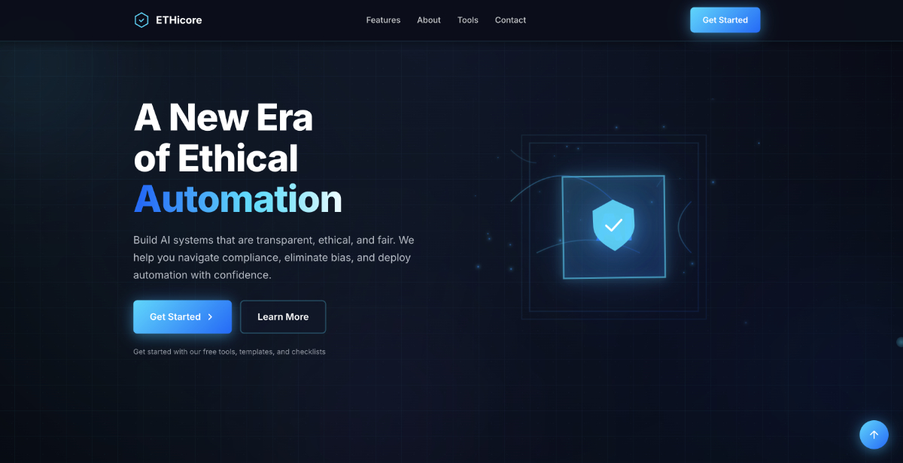

# ETHICORE - Ethical AI Automation Website



**Live Demo:** [ETHICORE ansehen](https://ddave82.github.io/ETHICORE-Concept-Website/)

---

## 📋 Project Overview

ETHICORE is a modern, premium website concept for a fictional company in the ethical AI automation space. The project demonstrates contemporary web design with advanced CSS animations, interactive JavaScript effects, and responsive layout.

The website presents a vision for transparent, fair, and ethically responsible AI systems and provides a comprehensive overview of features, tools, and services in the field of responsible AI automation.

---

## 🎨 Design-Features

### Visual Elements

- **Glassmorphism Design**: Modern glass-like cards with backdrop filter effects
- **Gradient Overlays**: Dynamic color gradients in cyan-blue tones
- **Animated 3D Cube**: Interactive, rotating AI cube as main visual in hero section
- **Particle System**: Animated particle system with floating effect
- **Energy Rings**: Pulsating energy rings around the AI cube
- **Light Sweep Effect**: Diagonal light sweep effect across the entire page
- **Gradient Orbs**: Animated background orbs with parallax effect
- **Dot Pattern**: Subtle dot pattern as background texture

### Interactive Effects

- **Hover Animations**: Lift and glow effects on interactive elements
- **Magnetic Buttons**: Buttons with magnetic mouse-follow effect
- **Spotlight Effect**: Dynamic spotlight that follows the mouse
- **Scroll Animations**: Fade-in and slide-up animations on scroll
- **Progress Bar**: Visual scroll progress bar
- **Smooth Scrolling**: Smooth transitions between sections
- **Parallax Effects**: Depth perception through offset moving elements
- **Custom Cursor**: Customized cursor with glow effect (Desktop)

---

## 🛠 Technology Stack

### Frontend Technologies

- **HTML5**: Semantic markup with modern standards
- **CSS3**: Advanced CSS features including Custom Properties, Grid, Flexbox
- **Vanilla JavaScript**: No framework dependencies, pure ES6+

### CSS Features

- **CSS Custom Properties**: Fully customizable design variables
- **CSS Grid & Flexbox**: Modern layout systems
- **CSS Animations**: Keyframe animations for smooth movements
- **Backdrop Filter**: Glassmorphism effects
- **CSS Transforms**: 3D transformations for the cube
- **Media Queries**: Responsive design for all screen sizes

### JavaScript Features

- **Intersection Observer API**: Performance-optimized scroll animations
- **RequestAnimationFrame**: Smooth animations at 60fps
- **Event Delegation**: Efficient event handling
- **Throttling & Debouncing**: Optimized performance for scroll and mouse events
- **OOP Structure**: Modular, maintainable code with classes

---

## 📐 Architecture

### File Structure

```
ETHICORE-Concept-Website/
│
├── index.html          # Main HTML structure
├── style.css           # Complete styling definition
├── script.js           # JavaScript functionality
└── images/
    └── screenshot.jpg  # Preview screenshot
```

### HTML Structure

The website is divided into the following main sections:

1. **Hero Section**: Introduction with animated 3D cube and call-to-actions
2. **Features Section**: Three main features with icons and descriptions
3. **About Section**: Company philosophy and values
4. **Tools Section**: Overview of available tools and resources
5. **Preparation Section**: Call-to-action for risk reduction
6. **Contact Section**: Contact information and CTA card
7. **Footer**: Links, social media, and legal notices

### CSS Organization

```
1. Reset & Variables       → Basic resets and CSS variables
2. Global Styles           → Body, Container, Typography
3. Background Effects      → Orbs, Patterns, Gradients
4. Navigation              → Navbar, Mobile Menu
5. Hero Section           → Hero layout, Cube, Particles
6. Features Section       → Feature cards, Icons
7. About Section          → Team, Values
8. Tools Section          → Tool grid, Descriptions
9. Contact Section        → Contact form, Info cards
10. Footer                → Footer layout, Links
11. Utilities             → Helper classes, Animations
12. Responsive Design     → Media Queries
```

### JavaScript Classes & Methods

```javascript
ModernWebsite {
    // Navigation
    setupNavbar()
    setupSmoothScroll()
    setupMobileMenu()
    
    // Animations
    setupScrollAnimations()
    setupParallax()
    setupFloatingElements()
    setupCubeInteraction()
    
    // Effects
    setupHoverEffects()
    setupSpotlightEffect()
    setupMagneticButtons()
    setupCursorEffect()
    
    // UI Components
    setupBackToTop()
    setupScrollProgress()
    setupStatsCounter()
    setupSectionReveal()
    
    // Particle System
    createParticles()
    animateParticles()
}
```

---

## 🎯 Features in Detail

### Navigation

- **Sticky Navigation**: Remains fixed at the top while scrolling
- **Scroll Effects**: Transparency changes and shadow on scroll
- **Mobile Menu**: Hamburger menu for mobile devices with slide-in animation
- **Active States**: Visual highlighting of current section

### Hero Section

- **3D Cube Animation**: Fully animated, interactive cube
- **Particle System**: 30 animated particles with individual movement patterns
- **Energy Rings**: 3 pulsating rings with different sizes
- **Responsive Typography**: Gradient text with automatic scaling
- **Shield Icon**: Animated security symbol with glow effect

### Feature Cards

- **Glass Effect**: Semi-transparent cards with backdrop-blur
- **Hover Lift**: 3D transform on hover
- **Icon Animations**: SVG icons with gradient fills
- **Grid Layout**: Responsive 3-column layout

### Performance Optimizations

- **Lazy Loading**: Intersection Observer for on-demand animations
- **Throttling**: Reduced event frequency for scroll and mouse events
- **RequestAnimationFrame**: GPU-accelerated animations
- **CSS Transform**: Hardware-accelerated transformations instead of layout properties
- **Will-Change**: Optimized rendering performance for animated elements

---

## 📱 Responsive Design

### Breakpoints

- **Desktop**: > 1024px - Full features including custom cursor
- **Tablet**: 768px - 1024px - Adapted grid layout
- **Mobile**: < 768px - Single-column layout, simplified animations

### Mobile Optimizations

- Hamburger menu with overlay
- Touch-optimized button sizes
- Reduced animations for better performance
- Optimized font sizes
- Stack layout instead of grid

---

## 🎨 Design-System

### Farbpalette

```css
--cyan: #00D9FF           /* Primärfarbe - Akzente */
--blue: #0066FF           /* Sekundärfarbe - Links */
--navy: #001A4D           /* Dunkler Hintergrund */
--dark-navy: #000D26      /* Noch dunklerer Hintergrund */
--white: #FFFFFF          /* Text auf dunklem Grund */
--gray: #6B7280           /* Sekundärer Text */
```

### Typografie

- **Font Family**: Inter (Google Fonts)
- **Weights**: 300, 400, 500, 600, 700, 800
- **Line Height**: 1.6 für optimale Lesbarkeit
- **Font Smoothing**: Antialiased für scharfe Schrift

### Spacing-System

```css
--section-padding: 120px           /* Desktop */
--section-padding-mobile: 60px     /* Mobile */
--container-width: 1280px          /* Max Content Width */
```

---

## 🚀 JavaScript-Features

### Event-Handling

- **Scroll-Events**: Throttled scroll listener für Performance
- **Mouse-Events**: Debounced mouse tracking für Parallax und Spotlight
- **Resize-Events**: Responsive Anpassungen bei Fenstergrößenänderung
- **Click-Events**: Event delegation für effizientes Handling

### Animations-Engine

- **Intersection Observer**: Triggert Animationen beim Erscheinen im Viewport
- **RequestAnimationFrame**: Synchronisiert Animationen mit Browser-Refresh-Rate
- **CSS Classes**: Toggle-basierte Animationen via JavaScript
- **Timing Functions**: Cubic-bezier für natürliche Bewegungen

### Custom Cursor System

- Folgt Mausbewegung mit Verzögerung
- Größenänderung bei Hover auf interaktive Elemente
- Glow-Effekt mit Gradient
- Nur auf Desktop-Geräten aktiv

---

## 🔧 Browser-Kompatibilität

### Unterstützte Browser

- ✅ Chrome/Edge (neueste Version)
- ✅ Firefox (neueste Version)
- ✅ Safari (neueste Version)
- ✅ Opera (neueste Version)

### Verwendete moderne Features

- CSS Custom Properties
- CSS Grid & Flexbox
- Backdrop Filter
- Intersection Observer API
- CSS Transforms 3D
- RequestAnimationFrame
- ES6+ JavaScript (Arrow Functions, Classes, Template Literals)

### Fallbacks

- Graceful Degradation für ältere Browser
- Feature Detection vor Verwendung moderner APIs
- Alternative Layouts ohne CSS Grid

---

## 💡 Best Practices

### Performance

- Minimale DOM-Manipulationen
- Debounced/Throttled Event-Listener
- CSS Transform statt Position-Properties
- GPU-beschleunigte Animationen
- Lazy Loading von Animationen

### Accessibility

- Semantisches HTML5-Markup
- ARIA-Labels für interaktive Elemente
- Keyboard-Navigation Support
- Ausreichende Kontrastverhältnisse
- Skip-Links für Screenreader

### Code-Qualität

- Konsistente Code-Formatierung
- Aussagekräftige Variablen- und Funktionsnamen
- Modulare JavaScript-Struktur
- Kommentierte Sektionen
- DRY-Prinzip (Don't Repeat Yourself)

---

## 📝 Konzept & Inhalt

### Brand Identity

**ETHICORE** steht für ethische KI-Automatisierung und repräsentiert:

- **Transparenz**: Offene und nachvollziehbare KI-Systeme
- **Fairness**: Bias-freie Algorithmen und gerechte Entscheidungen
- **Compliance**: GDPR-konforme und rechtssichere Lösungen
- **Innovation**: Modernste Technologie mit menschlichen Werten

### Content-Struktur

Die Website ist so konzipiert, dass sie eine komplette Customer Journey abbildet:

1. **Awareness**: Hero mit klarer Value Proposition
2. **Interest**: Features zeigen konkrete Vorteile
3. **Consideration**: About-Sektion schafft Vertrauen
4. **Action**: Mehrere CTAs führen zur Kontaktaufnahme

---

## 🎓 Lernressourcen

Dieses Projekt demonstriert fortgeschrittene Konzepte in:

- **Modern CSS**: Grid, Flexbox, Custom Properties, Animations
- **Vanilla JavaScript**: OOP, Event-Handling, DOM-Manipulation
- **UI/UX Design**: Microinteractions, Visual Hierarchy, User Flow
- **Performance**: Optimization Techniques, Lazy Loading
- **Responsive Design**: Mobile-First, Breakpoints, Flexible Layouts

---

## 📄 Lizenz

Dieses Projekt ist ein Konzept-Showcase und dient ausschließlich zu Demonstrationszwecken.

---

## 👤 Autor

**David** - Media Designer & Web Developer  
Denmark

---

## 🌟 Acknowledgments

- **Inter Font**: Google Fonts
- **Design Inspiration**: Vercel, Stripe, Linear
- **Icons**: Custom SVG Graphics
- **Color Palette**: Cyber-Tech inspired Gradient Scheme

---

*Erstellt mit Fokus auf moderne Webstandards, Performance und Premium-Ästhetik.*
